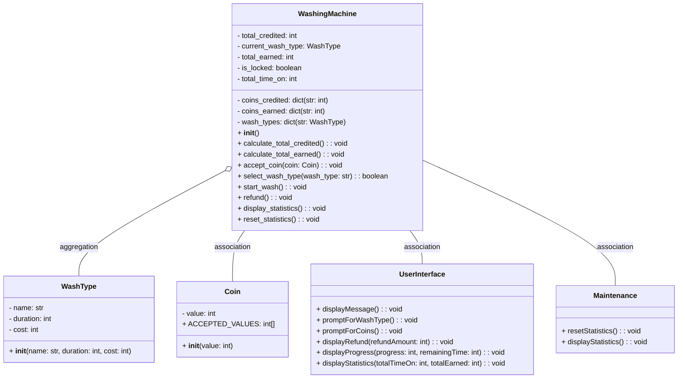

# Design an Optimised Search Function

## Problem Statement

You are in charge of building a system to keep track of all books in a newly opened library. The
library has given you the following system constraints:

1. All books will fall into one of twelve categories, labelled A, B, C, D, E, F, G, H, I, J, K, L.
2. All books will have a title
3. All books will contain the author’s last name
4. All books are unique, no two books are the same
5. All books must be issued a 32-character unique code at the time it is logged into the system.

Design and build a system to:

1. Ingest books and issue them a 32-character unique code when they are created
2. Let users search by any one of, or combination of, the following search fields:
   1. Category
   2. Book title (including partial search)
   3. Author’s last name (including partial search)
3. The search shall return the book title and the unique 32-character code
4. The librarian is very impatient, and the system must search books in the fastest way possible.
5. The library has no budget for a database, you must implement solution only in code.
You are free to implement the solution in the language of your choice. You can demonstrate the
functionality of your code in either a simple graphical UI or on the console.
Design and document the solution, provide a class diagram, and provide the necessary examples or
commands to demonstrate that the above requirements are met.
Your code shall be able to allow users to add books and search books.

## Class Diagram

## Run the code

To test the requirements:
